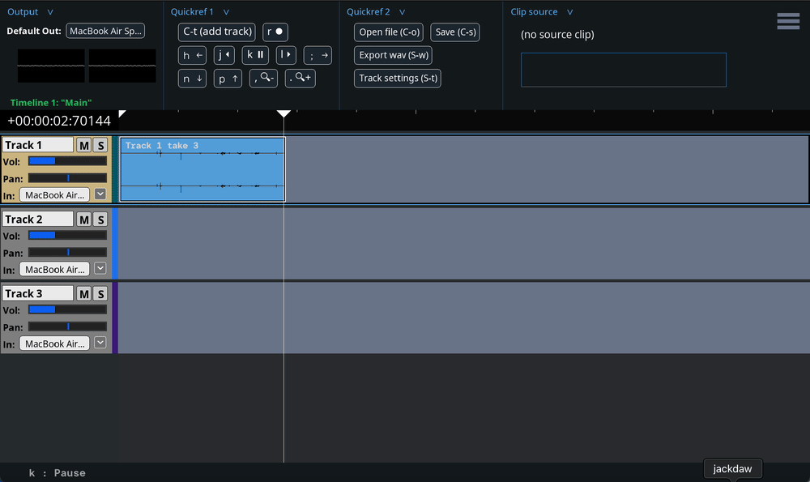

# Jackdaw (WIP)
A stripped-down, keyboard-focused digital audio workstation (DAW) taking some design cues from non-linear video editors like Avid. Built on SDL (https://libsdl.org/).


## Table of Contents
1. [Disclaimer](#disclaimer)
2. [Installation](#installation)
    1. [Compatibility](#os-compatibility)
	2. [Dependencies](#dependencies)
    3. [Bash scripts](#bash-scripts)
    4. [Manual installation](#manual-installation)
3. [Keyboard command syntax](#keyboard-command-syntax)
4. [Quickstart (getting comfortable)](#quickstart-getting-comfortable)
    1. [Adding tracks and setting input](#1-adding-tracks-and-setting-input)
    2. [Recording some audio](#2-recording-some-audio)
    3. [Playback](#3-playback)
    4. [Multi-track audio](#4-multi-track-audio)
    5. [Exporting a .wav file](#5-exporting-a-.wav-file)
    6. [Saving your project](#6-saving-your-project)
5. [Function reference](#function-reference)
6. [User manual](#user-manual)
    1. [Menus](#menus)
	2. [Timeline navigation and playback](#timeline-navigation-and-playback)
	     1. [Transport](#transport)
		 2. [Translate / zoom](#translate--zoom)
		 3. [Track selector](#track-selector)
		 4. ["Point"](#point)
		 5. [Marks and jump-to](#marks-and-jump-to)
		 6. [Scrolling](#scrolling)
	3. [Recording](#recording)
	4. [Tracks](#tracks)
		 1. [Activating / deactivating tracks](#activating--deactivating-tracks)
		 2. [Muting / soloing](#muting--soloing)
		 3. [Adjust volume / pan](#adjust-volume--pan)
		 4. [Set track input](#set-track-input)
	5. [Clips](#clips)
		 1. ["Clips" vs "Clip references"](#technical-note-clips-vs-clip-references)
		 2. ["Grabbing" and moving clips](#grabbing-and-moving-clips)
		 3. [Cutting clips](#cutting-clips)
	6. [Sample mode / Source mode](#sample-mode--source-mode)
	7. [Project navigation / multiple timelines](#project-navigation--multiple-timelines)
	8. [Opening and saving files](#opening-and-saving-files)
	

## Disclaimer

Jackdaw is very much a work in progress! What's currently available here is fun to use, can do a lot, and can definitely be used to make music; but I don't yet consider it to be "released." I do not guarantee that things will work perfectly or as you expect them.

## Installation

Currently, the only way to install Jackdaw is to build it from the source code. The first step is to clone the repository:

```console
$ git clone https://github.com/chvolow24/jackdaw.git

```

### OS compatibility

Jackdaw is compatibile with macOS and Linux.

### Dependencies

Jackdaw is dependent on the [SDL2](https://libsdl.org/) library, and related [SDL2_ttf](https://wiki.libsdl.org/SDL2_ttf/FrontPage) library.

### Bash scripts

Two scripts are provided in this repository to make installation and updating easier: `install.sh` and `update.sh`. I don't want to actively encourage their use, because I don't want to encourage you to run bash scripts written by strangers on your machine. But I use them, and they're there if you want them.

Executing `install.sh` will attempt to install Jackdaw's dependencies ([SDL2](https://www.libsdl.org/) and [SDL2_ttf](https://wiki.libsdl.org/SDL2_ttf/FrontPage)) on your system. In order to do so, it will also install homebrew on macos if not already installed. It will then build the `jackdaw` executable, and move it to `/usr/local/bin`, so that you can run it from the command line in any directory.

`update.sh` pulls any available updates from the remote repository, re-executes itself*, and then moves the executable to `/usr/local/bin`.

*This is basically to make it so that you don't have to `git pull` in order to run the latest version of `update.sh`. But it would also be a great way for me to run malicious code on your computer! Proceed with caution (or trust). 

### Manual installation

If you don't want to use my scripts, you'll need to manually install the dependencies, build the project, and then do whatever you want with the executable.

#### Installing dependencies (SDL2 and SDL2_ttf)

Detailed instructions for installing SDL can be found [here](https://wiki.libsdl.org/SDL2/Installation). 

##### macOS

[Homebrew](https://brew.sh/) should work just fine: 
```console
$ brew install sdl2
$ brew install sdl2_ttf
```

##### linux

You may want to build SDL from source by default instead of using `apt-get`; I found that the version of SDL provided by `apt-get` on ubuntu was too old.

SDL2_ttf can be installed with the package manager, though:

```console
$ sudo apt-get install libsdl2-ttf-2.0-0
$ sudo apt-get install libsdl2-ttf-dev
```

#### Build the project

Navigate to the main jackdaw directory (where you cloned this repository) and run `make`:

```console
$ make
```

If there are errors, please feel free to create an issue on this repository; I'd be happy to look into it. 

#### Run the executable

If `make` executed successfully, there should be an executable named `jackdaw` in the current directory.

```console
$ ./jackdaw
```

## Keyboard command syntax

Jackdaw is a keyboard-based application; it uses the mouse and GUI buttons very sparingly. Here are some examples of keyboard commands you'll see written in the application and in this documentation:

<kbd>n</kbd>......................................press the 'n' key<br>
<kbd>p</kbd>......................................press the 'p' key<br>
<kbd>C-s</kbd>...................................hold down 'command' OR 'ctrl', and press the 's' key<br>
<kbd>A-t</kbd>....................................hold down 'alt' OR 'option' and press the 't' key<br>
<kbd>C-S-o</kbd>.................................hold down 'command' OR 'ctrl', AND 'shift', and press the 'o' key<br>
<kbd>S-\<ret\></kbd>..............................hold down 'shift' and press the 'return' or 'enter' key<br>

When a hyphen is present (as in <kbd>C-s</kbd>) it means you need to hold down one or more modifier key before striking the final key to invoke the command.

Capital <kbd>C</kbd> stands for the "Command" OR "Control" key. Jackdaw does not distinguish between these two keys.<br>
Capital <kbd>S</kbd> stands for the "Shift" key.<br>
Capital <kbd>A</kbd> stands for the "Alt" or "Option" key. (Again, no distinction is made)<br>
Capital <kbd>K</kbd> indicates that you must hold down the 'K' key, which is used as a modifier in very specific circumstances.

So, <kbd>C-S-o</kbd> means hold down the control (or command) key and the shift key, and then press 'o'.

Most of the final keys are named by a letter or number, except for these:<br>
<kbd>\<ret\></kbd> means 'return' or 'enter'<br>
<kbd>\<tab\></kbd> means 'tab'<br>
<kbd>\<spc\></kbd> is the spacebar<br>
<kbd>\<del\></kbd> is the 'delete' or 'backspace' key (no distinction)<br>
<kbd>\<up\></kbd>, <kbd>\<down\></kbd>, <kbd>\<left\></kbd>, and <kbd>\<right\></kbd> are the arrow keys<br>

This will all be familiar to emacs users, and hopefully not too painful for everyone else.


## Quickstart (getting comfortable)

This section is a brief tutorial meant to familiarize you with the most basic and frequently-used operations in jackdaw. From there, you can reference the [user manual](#user-manual) to learn about the other things you can do in the program.

### 1. Adding tracks and setting input

The first thing you'll probably want to do upon opening jackdaw is to **add a track** or two. You can do this with<br>
<kbd>C-t</kbd>

(Hold down <kbd>cmd</kbd> or <kbd>ctrl</kbd> and hit <kbd>t</kbd>).
<!--  -->


The track input will be set to the default system audio input device, but you can **change the current track input** if you like with <kbd>C-S-i</kbd>. A list of available input devices will appear. Use <kbd>n</kbd> (for 'next') to go to the next item in the list, and <kbd>p</kbd> (for 'previous') to go to the previous. (These keys will be used a lot). Hit <kbd>\<ret\></kbd> to choose the currently-highlighted device.

### 2. Recording some audio

Once you have selected an appropriate audio input device, you can **start recording audio** into jackdaw with <kbd>r</kbd>. After making some noise at your computer or microphone, **stop recording** with <kbd>r</kbd>.


### 3. Playback

You should now see a clip on your timeline, with an audio waveform representing the audio you just recorded. You can rewind over the clip, pause, and play it back with the <kbd>j</kbd> (rewind) <kbd>k</kbd> (pause) and <kbd>l</kbd> (play) keys.
<br><br>
#### J K L : (Rewind | Pause | Play)
<br><br>
If you tap <kbd>l</kbd> or <kbd>j</kbd> multiple times, the playback speed will double.


### 4. Multi-track audio

The clip you recorded landed on the first track by default. You can again use the <kbd>n</kbd> and <kbd>p</kbd> keys to **move the track selector** up and down. Try rewinding back to the beginning of the recording you made, selecting a different track, and recording some new audio.



### 5. Exporting a .wav file

Now that you've created some multi-track audio, you might want to export it to a wav file to show your friends. First you'll need to place in and out marks on your timeline with <kbd>i</kbd> and <kbd>o</kbd>. Once you have placed them such that some portion of the timeline is marked, you can export to a wav file with <kbd>S-w</kbd>.

You will first be prompted to entire a file name. Hit <kbd>tab</kbd> or <kbd>\<ret\></kbd> to apply the current name, and move down to the directory navigation pane. Then, use <kbd>n</kbd> and <kbd>p</kbd> to navigate through the filesystem to the directory where you want to save the file. Finally, use <kbd>C-\<ret\></kbd> to "submit the form" and save the file.


### 6. Saving your project

If you want to revisit this project later, you can save a project file (`.jdaw`) with `C-s`.

You will be prompted to enter a project name (which MUST include the `.jdaw` extension), and can then hit <kbd>\<ret\></kbd> or <kbd>\<tab\></kbd> to move down to the directory navigation pane. Navigate to the location at which you want to save the project (with <kbd>n</kbd> and <kbd>p</kbd>), and submit the form with <kbd>C-\<ret\></kbd> to complete saving.

# Function reference

### global mode
- Summon menu : <kbd>C-m</kbd>
- Quit : <kbd>C-q</kbd>
- Undo : <kbd>C-z</kbd>
- Redo : <kbd>C-y</kbd>
- Save Project : <kbd>C-s</kbd>
- Open File (.wav or .jdaw) : <kbd>C-o</kbd>
- Start or stop screenrecording : <kbd>A-S-p</kbd>
### menu_nav mode
- Next item : <kbd>n</kbd>, <kbd>f</kbd>
- Previous item : <kbd>p</kbd>, <kbd>d</kbd>
- Next section : <kbd>C-n</kbd>, <kbd>C-\<up\></kbd>
- Previous section : <kbd>C-p</kbd>, <kbd>C-\<down\></kbd>
- Choose item : <kbd>\<ret\></kbd>, <kbd>\<spc\></kbd>, <kbd>k</kbd>
- Column right : <kbd>l</kbd>
- Column left : <kbd>j</kbd>
- Move menu up : <kbd>\<up\></kbd>
- Move menu down : <kbd>\<down\></kbd>
- Move menu right : <kbd>\<right\></kbd>
- go back (dismiss) : <kbd>m</kbd>, <kbd>h</kbd>
### timeline mode
#### Playback / Record
- Play : <kbd>l</kbd>, <kbd>e</kbd>
- Pause : <kbd>k</kbd>, <kbd>w</kbd>, <kbd>S-k</kbd>
- Rewind : <kbd>j</kbd>, <kbd>q</kbd>
- Play slow : <kbd>K-l</kbd>, <kbd>S-l</kbd>
- Rewind slow : <kbd>K-j</kbd>, <kbd>S-j</kbd>
- Record (start or stop) : <kbd>r</kbd>
#### Timeline navigation
- Move track selector up : <kbd>p</kbd>, <kbd>d</kbd>
- Move track selector down : <kbd>n</kbd>, <kbd>f</kbd>
- Move view right : <kbd>;</kbd>
- Move view left : <kbd>h</kbd>
- Zoom out : <kbd>,</kbd>
- Zoom in : <kbd>.</kbd>
#### Marks
- Set In : <kbd>i</kbd>
- Set Out : <kbd>o</kbd>
- Go to In : <kbd>S-i</kbd>
- Go to Out : <kbd>S-o</kbd>
- Go to t=0 : <kbd>S-u</kbd>
#### Output
- Set default audio output : <kbd>C-S-o</kbd>
#### Tracks
- Add Track : <kbd>C-t</kbd>
- Activate/deactivate selected track : <kbd>\<spc\></kbd>, <kbd>\<ret\></kbd>
- Activate/deactivate all tracks : <kbd>`</kbd>
- Destroy selected track (permanent) : <kbd>C-\<del\></kbd>
- Select track 1 : <kbd>1</kbd>
- Activate track 2 : <kbd>2</kbd>
- Activate track 3 : <kbd>3</kbd>
- Activate track 4 : <kbd>4</kbd>
- Activate track 5 : <kbd>5</kbd>
- Activate track 6 : <kbd>6</kbd>
- Activate track 7 : <kbd>7</kbd>
- Activate track 8 : <kbd>8</kbd>
- Activate track 9 : <kbd>9</kbd>
#### Track settings
- Mute or unmute selected track(s) : <kbd>m</kbd>
- Solo or unsolo selected track(s) : <kbd>s</kbd>
- Track volume up : <kbd>S-=</kbd>
- Track volume down : <kbd>S--</kbd>
- Track pan left : <kbd>S-9</kbd>
- Track pan right : <kbd>S-0</kbd>
- Rename selected track : <kbd>C-r</kbd>
- Set track input : <kbd>C-S-i</kbd>
#### Clips
- Grab clip at point : <kbd>g</kbd>
- Start or stop dragging clips : <kbd>C-k</kbd>
- Cut clip at point : <kbd>S-c</kbd>
- Delete selected clip(s) : <kbd>\<del\></kbd>
#### Sample mode
- Load clip at point to source : <kbd>C-1</kbd>
- Activate Source Mode : <kbd>S-1</kbd>
- Drop clip from source : <kbd>b</kbd>
- Drop previously dropped clip (1) : <kbd>v</kbd>
- Drop previously dropped clip (2) : <kbd>c</kbd>
- Drop previously dropped clip (3) : <kbd>x</kbd>
#### Project navigation
- Add new timeline : <kbd>A-t</kbd>
- Previous timeline : <kbd>A-j</kbd>
- Next timeline : <kbd>A-l</kbd>
#### Export
- Write mixdown to .wav file : <kbd>S-w</kbd>
### source mode
- Play (source) : <kbd>l</kbd>
- Pause (source) : <kbd>k</kbd>, <kbd>S-k</kbd>
- Rewind (source) : <kbd>j</kbd>
- Play slow (source) : <kbd>S-l</kbd>, <kbd>K-l</kbd>
- Rewind slow (source : <kbd>S-j</kbd>, <kbd>K-j</kbd>
- Set In Mark (source) : <kbd>i</kbd>, <kbd>S-i</kbd>
- Set Out Mark (source) : <kbd>o</kbd>, <kbd>S-o</kbd>
### modal mode
- Go to next item : <kbd>n</kbd>, <kbd>f</kbd>
- Go to previous item : <kbd>p</kbd>, <kbd>d</kbd>
- Go to next item (escape DirNav) : <kbd>S-n</kbd>, <kbd>S-f</kbd>
- Go to previous item (escape DirNav) : <kbd>S-p</kbd>, <kbd>S-d</kbd>
- Select item : <kbd>\<ret\></kbd>, <kbd>\<spc\></kbd>
- Dismiss modal window : <kbd>m</kbd>, <kbd>h</kbd>
- Submit form : <kbd>C-\<ret\></kbd>

# User manual

## Menus

**At any* time**, you can summon a menu with a list of available actions (and keyboard shortcuts) with <kbd>C-m</kbd>. The menu will display the functions available in the current mode (see "Input modes" below). Navigate with <kbd>n</kbd>, <kbd>p</kbd>, and <kbd>/<ret/></kbd> to select. 

Summoning these menus when in doubt might be the best way to learn the available keyboard shortcuts. 

*except when editing a text field. I intend to fix this and other problems related to text entry soon. 

## Timeline navigation and playback

Timeline navigation functions are all within easy reach of your right hand:

### Transport
<kbd>j</kbd> : **rewind** (multiple taps to rewind fast)<br>
<kbd>k</kbd> : **pause**<br>
<kbd>l</kbd> : **play** (multiple taps to play fast)<br>


### Translate / zoom
<kbd>h</kbd> : **move view left**<br>
<kbd>;</kbd> : **move view right**<br>
<kbd>,</kbd> : **zoom out**<br>
<kbd>.</kbd> : **zoom in**<br>

These zoom functions will center on the current playhead position. Another way to zoom is to hold <kbd>Cmd</kbd> or <kbd>Ctrl</kbd> and scroll up or down while the mouse is over the timeline. In this case, zoom will center on the mouse position. 

### Track selector

The *track selector* is how you indicate which track your are doing things to. The track console (left side) is highlighted in orange if the track is currently selected.

<kbd>n</kbd> : **move selector down** (next track)<br>
<kbd>p</kbd> : **move selector up** (previous track)<br>
<kbd>\<ret\></kbd> : **activate/deactivate current track**<br>

**Activating** tracks (as opposed to merely *selecting* them) is a way to do things that might normally be done to only one track to multiple tracks at once. For example, if you activate tracks 1, 2, and 3, and then hit <kbd>r</kbd> to record, you will wind up with *three* clips (more accurately, clip references) -- one on each track -- instead of one. The numerical keys (<kbd>1</kbd>, <kbd>2</kbd>, <kbd>3</kbd> etc.) can be used to quickly activate or deactivate tracks 1-9 without using the track selector.

### "Point"

The "point" (as in "[do thing] at point" is the location in the currently active timeline, under the current playhead position, on the currently selected track. So, *"grab clip at point"* means "grab the top clip on the currently selected track that intersects with the current playhead position."

### Marks and jump-to

In and out marks must be set to export a mixdown to .wav, and can also be used as handy jump-to points.

You can also jump to the start of the timeline (t=00:00:00000) with <kbd>S-u</kbd>, which can be helpful if you get lost. 

<kbd>i</kbd> : **mark in**<br>
<kbd>o</kbd> : **mark out**<br>
<kbd>S-i</kbd> : **jump to in mark**<br>
<kbd>S-o</kbd> : **jump to out mark**<br>
<kbd>S-u</kbd> : **jump to t=0**<br>

### Scrolling

When you move the track selector with <kbd>n</kbd> and <kbd>p</kbd>, the timeline will automatically refocus such that the selected track is visible. You can also scroll through tracks with a mouse or trackpad. Scrolling horizontally translates the timeline in the manner of <kbd>h</kbd> and <kbd>;</kbd>.

Holding <kbd>Cmd</kbd> or <kbd>Ctrl</kbd> and scrolling on the timeline will zoom in or out.

## Recording

<kbd>r</kbd> : **start or stop recording**<br>

When you hit <kbd>r</kbd>, audio recording will begin on all activated tracks -- or, if no tracks are activated, on the currently selected track. Clips are created on each of these tracks beginning at the current playhead position. When you stop recording, these clips will be populated with the audio data you just recorded.

You can record from multiple audio devices at once, simply by setting different inputs on different tracks, activating each of those tracks, and hitting <kbd>r</kbd>.

## Tracks

<kbd>C-t</kbd> : **add a track**<br>
<kbd>C-\<del\></kbd> : **delete the currently selected track**<br>

> [!CAUTION]
> In the current jackdaw version (v0.2.0), deleting a track will permanently delete all of its data, as well as any audio clip data native to that track and all references to those clips.

### Activating / deactivating tracks

If you are only ever doing things to one track at a time, you will never need to activate a track; you simply need to move the track selector (with <kbd>n</kbd> and <kbd>p</kbd>) to select your target track. However, if you would like to do things to multiple tracks at once, you can activate multiple tracks. Here are things you can do to multiple tracks at once:
-  adjust volume
-  adjust pan
-  record audio
-  grab clips

<kbd>\<ret\></kbd> : **Activate or deactivate the currently-selected track**<br>
<kbd>`</kbd> : **Activate or deactivate all tracks**<br>
<kbd>1</kbd> : **Activate or deactivate track 1**<br>
<kbd>2</kbd> : **Activate or deactivate track 2**<br>
...<br>
<kbd>9</kbd> : **Activate or deactivate track 9**<br>

### Muting / soloing

Muted tracks will not be read during playback, or when exporting a `.wav` file.

If any track on the timeline is soloed, only tracks that have been soloed will be read. The `S` button will be red on any un-soloed tracks to indicate that they are effectively muted.

<kbd>m</kbd> : **Mute currently selected track (or active tracks)**<br>
<kbd>s</kbd> : **Solo currently selected track (or active tracks)**<br>

### Adjust volume / pan

Track volume can be attenuated or boosted. Stereo tracks can be panned to the left or right. The pan implementation is fairly primitive; panning to either side will simply attenuate the opposite channel by an amount proportional to the pan amount.

> [!TIP]
> These key combinations can be held down for continuous adjustment.

<kbd>S--</kbd> : **Volume down (selected or active tracks)**<br>
<kbd>S-=</kbd> : **Volume up (selected or active tracks)**<br>
<kbd>S-9</kbd> : **Pan left (selected or active tracks)**<br>
<kbd>S-0</kbd> : **Pan right (selected or active tracks)**<br>

### Set track input

The track input can be set to any of the available system audio devices (e.g. built-in laptop microphone, extern microphone) or one of two special inputs, which are described below.

<kbd>C-S-i</kbd> : **Set track input**<br>

## Clips

### Technical note: "Clips" vs. "Clip references"

In general, this document and the application itself merely refer to any chunks of audio data present on the timeline as "clips." You may, however, notice that some clips are green, while others are blue. Why?

Under the hood, a "clip" is a chunk of audio data that is associated with a project, but is not directly associated with a timeline or track. A "clip reference" (or "clipref") is the data object that represents that association. It specifies which track it appears on, which clip it references, and the start and end positions within that clip that describe the boundaries as represented on the timeline.

A given clip can have many clip references. The actual audio data associated with the clip is not duplicated; therefore, when copying clips or portions of clips using Source Mode, you are not actually copying any audio data; you are merely creating additional references to the clip.

### "Grabbing" and moving clips

Clips that have been "grabbed" can be deleted or moved around on the timeline.

<kbd>g</kbd> : **Grab clips at point(s)**<br>

Using this function will grab any clips that intersect the playhead position on the currently selected track OR all active tracks. If all interesecting clips are already grabbed, the function will un-grab all clips.

A clip can also be "grabbed" with <kbd>C-\<click\></kbd>.

<kbd>C-k</kbd> : **Toggle drag clips**<br>

If clip dragging is enabled, an indiciation will appear in the status bar at the bottom of the screen indicating how many clips are currently grabbed.


Moving the track selector will pull all currently-dragging clips along with it.

### Cutting clips

<kbd>S-c</kbd> : **Cut clips at point**<br>

This will cut any clips on the currently selected track at the current playhead position in two, so that you can independently move or otherwise modify each part.


## Sample mode / Source mode

Jackdaw provides an interface for extracting samples from an audio clip, and dropping [references](#technical-note-clips-vs-clip-references) to those samples in your timeline.


<kbd>C-1</kbd> : **Load clip at point to source**<br>

If there is a clip at point, this function will load that clip to the source area near the top of the window. 

## Project navigation / multiple timelines

## Opening and Saving files

...


[ README IN PROGRESS -- LAST UPDATE 2024-06-07 FRIDAY ]

...
