# Jackdaw (WIP)
A free, open-source, keyboard-focused digital audio workstation (DAW). Written in C, using SDL (https://libsdl.org/).


## Table of Contents
1. [Disclaimer](#disclaimer)
2. [Compatibility](#os-compatibility)
3. [Dependencies](#dependencies)
4. [Installation](#installation)
    1. [The easy way: bash scripts](#the-easy-way-bash-scripts)
    2. [Manual installation](#manual-installation)
5. [Keyboard command shorthand](#keyboard-command-shorthand)
6. [Quickstart (getting comfortable)](#quickstart-getting-comfortable) 
7. [User manual](#user-manual)
    1. [Function lookup](#function-lookup)
    2. [Menus](#menus)
	3. [Timeline navigation and playback](#timeline-navigation-and-playback)
	     1. [Playback](#playback)
		 2. [Scrubbing / play speed](#scrubbing--play-speed)
		 3. [Translate / zoom](#translate--zoom)
		 4. [Move playhead](#move-playhead)
		 5. [Track selector](#track-selector)
		 6. ["Cursor"](#cursor)
		 7. [Marks and jump-to](#marks-and-jump-to)
		 8. [Scrolling](#scrolling)
		 9. [Loop playback](#loop-playback)
	4. [Recording](#recording)
	5. [Audio Tracks](#audio-tracks)
		 1. [Activating / deactivating tracks](#activating--deactivating-tracks)
		 2. [Muting / soloing](#muting--soloing)
		 3. [Adjusting volume / pan](#adjusting-volume--pan)
		 4. [Setting track input](#setting-track-input)
		 5. [Reordering tracks](#reordering-tracks)
		 6. [Minimizing tracks](#minimizing-tracks)
		 6. [Renaming tracks](#renaming-tracks)
			 1. [Editing text](#editing-text)
	6. [Clips](#clips)
		 1. ["Clips" vs "Clip references"](#technical-note-clips-vs-clip-references)
		 2. ["Grabbing" and moving clips](#grabbing-and-moving-clips)
		 3. [Clip overlap](#clip-overlap)
		 4. [Cutting clips](#cutting-clips)
		 5. [Renaming clips](#renaming-clips)
	7. [Click tracks](#click-tracks)
		 1. [Time signatures](#time-signatures)
		 2. [Click track segments](#click-track-segments)
		 3. [Metronome](#metronome)
		 4. [Set tempo](#set-tempo)
		 5. [Grid navigation](#grid-navigation)
	8. [Sample mode / Source mode](#sample-mode--source-mode)
	9. [Project navigation / multiple timelines](#project-navigation--multiple-timelines)
	10. [Opening and saving files](#opening-and-saving-files)
	11. [Track effects](#track-effects)
	     1. [Adding, ordering, and removing effects](#adding-ordering-and-removing-effects)
		 2. [EQ](#eq)
		 3. [FIR Filter](#fir-filter)
		 4. [Delay line](#delay-line)
		 5. [Saturation](#saturation)
		 6. [Compressor](#compressor)
	12. [Automation](#automation)
	     1. [Adding keyframes with the mouse](#adding-keyframes-with-the-mouse)
		 2. [Writing (adding keyframes automatically)](#writing-adding-keyframes-automatically)
		 3. [Deleting keyframes](#deleting-keyframes)
	13. [Undo / redo](#undo--redo)
	14. [Special audio inputs](#special-audio-inputs)
		 1. [Jackdaw out](#jackdaw-out)
		 2. [Pure data](#pure-data)
	15. [API](#api)
		 1. [Starting the server](#starting-the-server)
		 2. [Request syntax](#request-syntax)
8. [Function reference](#function-reference)

## Disclaimer

Jackdaw is a work in progress and has not been officially "released." What's available here is surprisingly powerful, fun to use, and can definitely be used to make music, but I do not guarantee that everything will work perfectly or as expected.

## OS compatibility

Jackdaw is compatibile with macOS and Linux. 

Jackdaw currently depends on POSIX system APIs for threading and synchronization, directory navigation, timing, and inter-process communication.

## Dependencies

Jackdaw depends on the [SDL2](https://libsdl.org/) library, and related [SDL2_ttf](https://wiki.libsdl.org/SDL2_ttf/FrontPage) library.

## Installation

Currently, the only way to install Jackdaw is to build it from the source code. The first step is to clone the repository:

```console
$ git clone https://github.com/chvolow24/jackdaw.git

```

### The easy way: bash scripts

Two scripts are provided in this repository to make installation and updating easier: `install.sh` and `update.sh`.

Executing `install.sh` will attempt to install Jackdaw's dependencies ([SDL2](https://www.libsdl.org/) and [SDL2_ttf](https://wiki.libsdl.org/SDL2_ttf/FrontPage)) on your system. In order to do so, it will also install homebrew on macos if not already installed. It will then build the `jackdaw` executable, and move it to `/usr/local/bin`, so that you can run it from the command line in any directory.

`update.sh` pulls any available updates from the remote repository, re-executes itself*, and then moves the executable to `/usr/local/bin`.

*This is so that you don't have to `git pull` in order to run the latest version of `update.sh`. But it would also be a great way for me to run malicious code on your computer! Proceed with caution (or trust). 

Once `install.sh` completes execution, you can launch jackdaw on the command line:

```console
$ jackdaw
```

### Manual installation

If you prefer not to run my bash scripts, you'll need to manually install the dependencies, build the project, and then do whatever you want with the executable.

#### Installing dependencies (SDL2 and SDL2_ttf)

Detailed instructions for installing SDL can be found [on their wiki](https://wiki.libsdl.org/SDL2/Installation), but here's a summary:

##### macOS

[Homebrew](https://brew.sh/) should work just fine: 
```console
$ brew install sdl2
$ brew install sdl2_ttf
```

##### linux

You may want to build SDL from source by default (again, see [wiki](https://wiki.libsdl.org/SDL2/Installation)) instead of using `apt-get`; I found that the version of SDL provided by `apt-get` on ubuntu was too old.

SDL2_ttf can be installed with the package manager, though:

```console
$ sudo apt-get install libsdl2-ttf-2.0-0
$ sudo apt-get install libsdl2-ttf-dev
```

#### Build the project

Navigate to the main jackdaw directory (where you cloned this repository) and run `make`:

```console
$ make
```

If there are errors, please feel free to create an issue on this repository; I'd be happy to look into it. 

#### Run the executable

If `make` executed successfully, there should be an executable named `jackdaw` in the current directory.

```console
$ ./jackdaw
```

## Keyboard command shorthand

Although the mouse can be used for almost everything, Jackdaw is fundamentally a keyboard-driven application. Here are some examples of keyboard commands you'll see written in the application and in this documentation:

<kbd>n</kbd>......................................press the 'n' key<br>
<kbd>p</kbd>......................................press the 'p' key<br>
<kbd>C-s</kbd>...................................hold down 'command' OR 'ctrl', and press the 's' key<br>
<kbd>A-t</kbd>....................................hold down 'alt' OR 'option' and press the 't' key<br>
<kbd>C-S-o</kbd>.................................hold down 'command' OR 'ctrl', AND 'shift', and press the 'o' key<br>
<kbd>S-\<ret\></kbd>..............................hold down 'shift' and press the 'return' or 'enter' key<br>

When a hyphen is present (as in <kbd>C-s</kbd>) it means you need to hold down one or more modifier key before striking the final key to invoke the command.

Capital <kbd>C</kbd> stands for the "Command" OR "Control" key. Jackdaw does not distinguish between these two keys.<br>
Capital <kbd>S</kbd> stands for the "Shift" key.<br>
Capital <kbd>A</kbd> stands for the "Alt" or "Option" key. (Again, no distinction is made)<br>
Capital <kbd>K</kbd> indicates that you must hold down the 'K' key, which is used as a modifier in very specific circumstances.

So, <kbd>C-S-o</kbd> means hold down the control (or command) key and the shift key, and then press 'o'.

Most of the final keys are named by a letter or number, except for these:<br>
<kbd>\<ret\></kbd> means 'return' or 'enter'<br>
<kbd>\<tab\></kbd> means 'tab'<br>
<kbd>\<spc\></kbd> is the spacebar<br>
<kbd>\<del\></kbd> is the 'delete' or 'backspace' key (no distinction)<br>
<kbd>\<up\></kbd>, <kbd>\<down\></kbd>, <kbd>\<left\></kbd>, and <kbd>\<right\></kbd> are the arrow keys<br>

This will all be familiar to emacs users, and hopefully not too painful for everyone else.


## Quickstart (getting comfortable)

This section is a brief tutorial meant to familiarize you with the most basic and frequently-used operations in jackdaw. From there, you can reference the [user manual](#user-manual) to learn about the other things you can do in the program.

### 1. Adding tracks and setting input

The first thing you'll probably want to do upon opening jackdaw is to **add a track** or two. You can do this with<br>
<kbd>C-t</kbd>

(Hold down <kbd>cmd</kbd> or <kbd>ctrl</kbd> and hit <kbd>t</kbd>).
<!-- 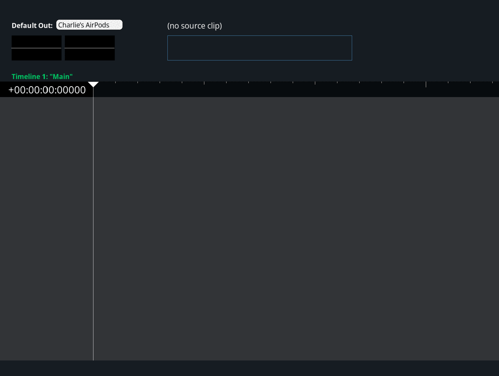 -->
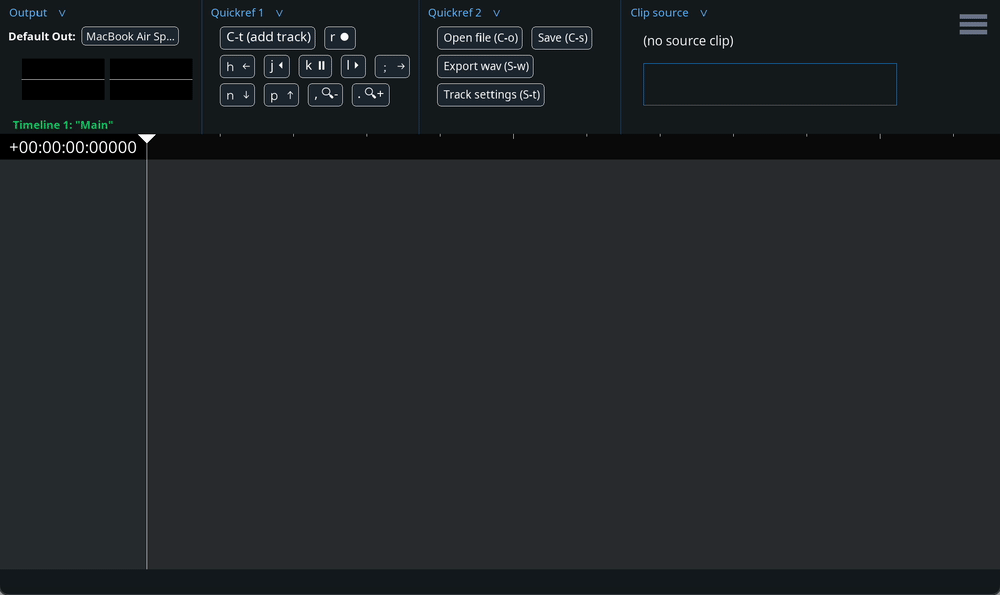

The track input will be set to the default system audio input device, but you can **change the current track input** if you like with <kbd>C-S-i</kbd> (ctrl-shift-i or cmd-shift-i). A list of available input devices will appear. Use <kbd>n</kbd> (for 'next') to go to the next item in the list, and <kbd>p</kbd> (for 'previous') to go to the previous. (These keys will be used a lot). Hit <kbd>\<ret\></kbd> to choose the currently-highlighted device.


> [!TIP]
> <kbd>n</kbd> and <kbd>p</kbd> are used globally for "next" and "previous", or "down" and "up". The <kbd>f</kbd> and <kbd>d</kbd> keys are mapped to all the same commands, and can be used instead if you prefer them.


### 2. Recording some audio

Once you have selected an appropriate audio input device, you can **start recording audio** into jackdaw with <kbd>r</kbd>. After making some noise at your computer or microphone, **stop recording** with <kbd>r</kbd>.


### 3. Playback

You should now see a clip on your timeline, with an audio waveform representing the audio you just recorded. You can rewind over the clip, pause, and play it back with the <kbd>j</kbd> (rewind) <kbd>k</kbd> (pause) and <kbd>l</kbd> (play) keys.

#### j k l : Rewind, Pause, Play

If you tap <kbd>l</kbd> or <kbd>j</kbd> multiple times, the playback speed will double. 

**These are jackdaw's most important key commands!**

### 4. Multi-track audio

The clip you recorded landed on the first track by default. You can again use the <kbd>n</kbd> and <kbd>p</kbd> keys to **move the track selector** up and down. Try rewinding back to the beginning of the recording you made, selecting a different track, and recording some new audio.


### 5. Exporting a .wav file

Now that you've created some multi-track audio, you might want to export it to a wav file to show your friends. 

First you'll need to place "in" and "out" marks on your timeline with <kbd>i</kbd> and <kbd>o</kbd>, which will place the mark at the current playhead position. You'll need to play/rewind/pause a bit (<kbd>j</kbd><kbd>k</kbd><kbd>l</kbd>! <kbd>j</kbd><kbd>k</kbd><kbd>l</kbd>!) to get the playhead positioned correctly to set the marks. Once you have placed in and out marks such that some portion of the timeline is visibly marked, you can export to a wav file with <kbd>S-w</kbd>.

You will be prompted to type a file name. Hit <kbd>tab</kbd> or <kbd>\<ret\></kbd> to apply the current name, and move down to the directory navigation pane. Then, use <kbd>n</kbd> and <kbd>p</kbd> to navigate through the filesystem to the directory where you want to save the file. Subdirectories are displayed in green. The double dots ("..") will bring you up one directory. Finally, use <kbd>\<tab\></kbd> to move down to the "Save" button, and then <kbd>\<ret\></kbd> to save the file with the current name, in the currently open directory. (Or, use <kbd>C-\<ret\></kbd> to "submit the form" and save the file.)

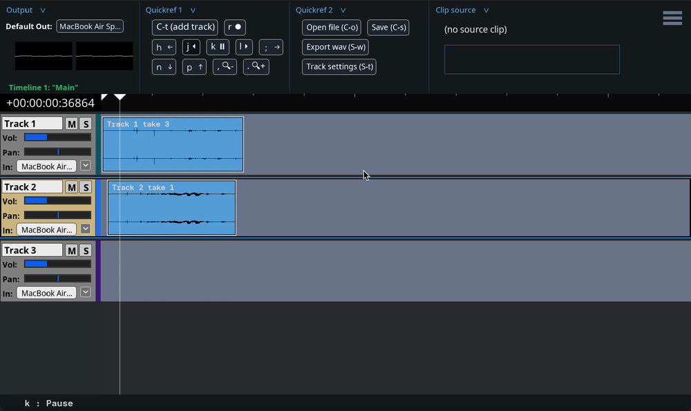

### 6. Saving your project

If you want to revisit this project later, you can save a project file (`.jdaw`) with `C-s`.

You will be prompted to enter a project name (which must include the `.jdaw` extension), and can then hit <kbd>\<ret\></kbd> or <kbd>\<tab\></kbd> to move down to the directory navigation pane. Navigate to the location at which you want to save the project (with <kbd>n</kbd> and <kbd>p</kbd>), and submit the form with <kbd>\<tab\></kbd> and then <kbd>\<ret\></kbd>to complete saving.

# User manual

## Function lookup

Jackdaw's user interface is built around keyboard commands, but you don't need to remember or look up these commands to use it. Hit the spacebar (<kbd>\<spc\></kbd>) to open an autocomplete dropdown list of available commands. You can start typing one or more keywords to see a list of matching commands. Use <kbd>\<tab\></kbd> to navigate down through the list, <kbd>S-\<tab\> to navigate up, <kbd>\<ret\></kbd> to select an item, and <kbd>\<esc\></kbd> to escape without selecting an item.

Each entry in the list includes the display name of the command on the left, and the bound keyboard command on the right.

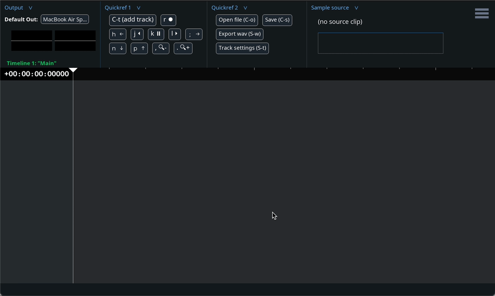

## Menus

You can also summon a menu with a list of available actions organized by category with <kbd>C-m</kbd> or <kbd>C-h</kbd> ("m" for menu, "h" for help). Navigate with <kbd>n</kbd>, <kbd>p</kbd> to move the selection up or down, and <kbd>j</kbd> and <kbd>l</kbd> to move left and right between columns. Then use <kbd>\<ret\></kbd> to select. Use <kbd>m</kbd> (or <kbd>h</kbd> or <kbd>\<esc\></kbd>) to dismiss the menu.

You can also summon the menu by clicking on the "hamburger" in the upper-right corner of the window.

## Timeline navigation and playback

Timeline navigation functions are all within easy reach of your right hand:

### Playback
<kbd>j</kbd> : **rewind** (multiple taps to rewind fast)<br>
<kbd>k</kbd> : **pause**<br>
<kbd>l</kbd> : **play** (multiple taps to play fast)<br>

### Scrubbing / play speed

You can use the mousewheel or trackpad to achieve finer control over playback.

> [!NOTE]
> These functions work best on trackpads with multi-finger touch detection, like those on macbooks.

<kbd>S-\<scroll horizontal\></kbd> : **scrub (fine)**<br>
<kbd>C-S-\<scroll horizontal\></kbd> : **scrub (coarse)**<br>

<kbd>S-\<scroll vertical\></kbd> : **adjust speed (fine)**<br>
<kbd>C-S-\<scroll vertical\></kbd> : **adjust speed (coarse)**<br>


### Translate / zoom
<kbd>h</kbd> : **move view left**<br>
<kbd>;</kbd> : **move view right**<br>
<kbd>,</kbd> : **zoom out**<br>
<kbd>.</kbd> : **zoom in**<br>

<kbd>C-\<scroll\></kbd> : **zoom in or out**<br>

These zoom functions will center on the current playhead position. Using the mousewheel/trackpad to zoom will center the zoom on the current mouse position. 

### Move playhead
<kbd>[</kbd> : **move playhead left**<br>
<kbd>]</kbd> : **move playhead right**<br>

<kbd>S-]</kbd> : **move playhead left (slow)**<br>
<kbd>S-[</kbd> : **move playhead right (slow)**<br>

Press and hold these commands to move the playhead around without playing back audio. The amount moved is relative to the window width, not a fixed time amount (unlike playback/rewind).

### Track selector

The *track selector* is how you indicate which track you are doing things to. The track console (left side) is highlighted in orange if the track is currently selected.

<kbd>n</kbd> : **move selector down** (next track)<br>
<kbd>p</kbd> : **move selector up** (previous track)<br>
<!-- <kbd>\<ret\></kbd> : **activate/deactivate current track**<br> -->

<!-- **Activating** tracks (as opposed to merely *selecting* them) is a way to do things that might normally be done to only one track to multiple tracks at once. For example, if you activate tracks 1, 2, and 3, and then hit <kbd>r</kbd> to record, you will wind up with *three* clips (more accurately, clip references) -- one on each track -- instead of one. The numerical keys (<kbd>1</kbd>, <kbd>2</kbd>, <kbd>3</kbd> etc.) can be used to quickly activate or deactivate tracks 1-9 without using the track selector. -->

### "Cursor"

The "cursor" (as in "[do thing] at cursor") is the location on the currently selected track under the current playhead position. So, *"grab clip at cursor"* means "grab the top clip on the currently selected track that intersects with the current playhead position."

Keystrokes that move the track selector or move the playhead can therefore also be thought of as ways to move the cursor:

<kbd>n</kbd> or <kbd>f</kbd> : **cursor down**<br>
<kbd>p</kbd> or <kbd>d</kbd> : **cursor up**<br>
<kbd>j</kbd> : **cursor left**<br>
<kbd>l</kbd> : **cursor right**</br>

The cursor concept is one of jackdaw's unique strengths.

### Marks and jump-to

"In" and "out" marks can be set to mark a range on the current timeline. They also be used as handy jump-to points.

You can also jump to the start of the timeline (t=00:00:00000) with <kbd>S-u</kbd>, which is helpful if you get lost. 

<kbd>i</kbd> : **mark in**<br>
<kbd>o</kbd> : **mark out**<br>
<kbd>S-i</kbd> : **jump to in mark**<br>
<kbd>S-o</kbd> : **jump to out mark**<br>
<kbd>S-u</kbd> : **jump to t=0**<br>
<kbd>S-j</kbd> : **jump to start of clip at point**
<kbd>S-l</kbd> : **jump to end of clip at point**

### Scrolling

When you move the track selector with <kbd>n</kbd> and <kbd>p</kbd>, the timeline will automatically refocus such that the selected track is visible. You can also scroll through tracks with a mouse or trackpad. Scrolling horizontally translates the timeline in the manner of <kbd>h</kbd> and <kbd>;</kbd>.

Holding <kbd>Cmd</kbd> or <kbd>Ctrl</kbd> and scrolling on the timeline will zoom in or out.


### Loop playback

You can play back a marked section of the timelines (see [section](#marks-and-jump-to) above) in a loop by enabling loop playback.

<kbd>C-8</kbd> : **Enable / disable loop playback**<br>

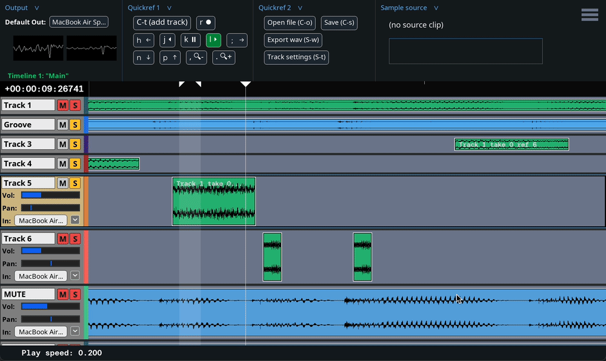

Future versions of jackdaw will include more sophisticated looping mechanisms.

## Recording

<kbd>r</kbd> : **start or stop recording**<br>

When you hit <kbd>r</kbd>, audio recording will begin on all [activated](#activating-deactivating-tracks) tracks, or, if no tracks are activated, on the currently selected track. Clips are created on each of these tracks beginning at the current playhead position. When you stop recording, these clips will be populated with the audio data you just recorded.

You can record from multiple audio devices at once, simply by setting different inputs on different tracks, activating each of those tracks, and hitting <kbd>r</kbd>.

## Audio Tracks

In the current version of jackdaw (v0.4.0) all tracks are stereo audio tracks.

<kbd>C-t</kbd> : **add a track**<br>
<kbd>C-\<del\></kbd> : **delete the currently selected track**<br>

### Activating / deactivating tracks

**Activating** tracks (as opposed to merely *selecting* them) is a way to do things that might normally be done to only one track to multiple tracks at once. Here are things you can do to multiple tracks at once:
-  adjust volume
-  adjust pan
-  record audio
-  grab clips

<kbd>\<ret\></kbd> : **Activate or deactivate the currently-selected track**<br>
<kbd>`</kbd> : **Activate or deactivate all tracks**<br>
<!-- <kbd>1</kbd> : **Activate or deactivate track 1**<br> -->
<!-- <kbd>2</kbd> : **Activate or deactivate track 2**<br> -->
<!-- ...<br> -->
<!-- <kbd>9</kbd> : **Activate or deactivate track 9**<br> -->

### Muting / soloing

Muted tracks will not be read during playback, or when exporting a `.wav` file.

If any track on the timeline is soloed, only tracks that have been soloed will be read. The `S` button will be red on any un-soloed tracks to indicate that they are effectively muted.

<kbd>m</kbd> : **Mute currently selected track (or active tracks)**<br>
<kbd>s</kbd> : **Solo currently selected track (or active tracks)**<br>

### Adjusting volume / pan

Track volume can be attenuated or boosted. Stereo tracks can be panned to the left or right. The pan implementation is fairly primitive; panning to either side will simply attenuate the opposite channel by an amount proportional to the pan amount.

> [!TIP]
> These key combinations can be held down for continuous adjustment.

<kbd>S--</kbd> : **Volume down (selected or active tracks)**<br>
<kbd>S-=</kbd> : **Volume up (selected or active tracks)**<br>
<kbd>S-9</kbd> : **Pan left (selected or active tracks)**<br>
<kbd>S-0</kbd> : **Pan right (selected or active tracks)**<br>

(Note that the pan adjustment keystrokes are the left and right parens.)

### Setting track input

The track input can be set to any of the available system audio devices (e.g. built-in laptop microphone, external microphone) or one of two special inputs, which are described below.

<kbd>C-S-i</kbd> : **Set track input**<br>

### Reordering tracks

If you hold down shift while moving the track selector up or down, the selected track will move with you.

<kbd>S-n</kbd> : **Move selected track down**<br>
<kbd>S-p</kbd> : **Move selected track up**<br>

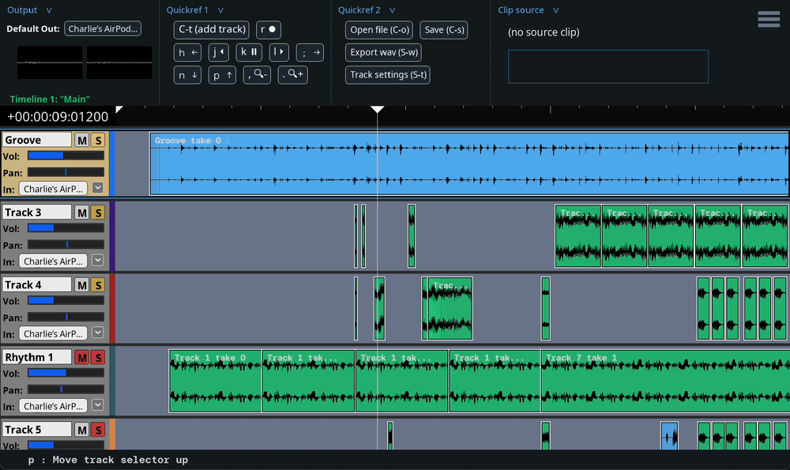

### Minimizing tracks

<kbd>-</kbd> : **Minimize / expand selected track(s)**<br>


### Renaming tracks

You can rename the selected track with <kbd>C-r</kbd>, or cmd/ctrl + click the track name label box.

<kbd>C-r</kbd> : **Rename selected track**<br>

#### Editing text

Renaming a track or other object will put the program into "text edit mode", in which most keystrokes are read as text input rather than as keycommands. Use <kbd>\<ret\></kbd> to complete your edit and "escape" text edit mode.

There are some very limited additional text editing commands that can be used while a text field is being edited:

<kbd>\<ret\></kbd>, <kbd>\<tab\></kbd>, <kbd>\<esc\></kbd> : **Escape text edit mode (complete edit)**<br>
<kbd>\<del\></kbd> : **Backspace**<br>
<kbd>\<right\></kbd>, <kbd>C-f</kbd> : **Move cursor to the right**<br>
<kbd>\<left\></kbd>, <kbd>C-d</kbd>, <kbd>C-b</kbd> : **Move cursor to the left**<br>
<kbd>C-a</kbd> : **Highlight all text**<br>


### Deleting tracks

<kbd>C-\<del\></kbd> : **Delete the currently-selected track**</br>

## Clips

A clip is a chunk of audio data represented on the timeline.

### Technical note: "Clips" vs. "Clip references"

In general, this document and the application itself refer to the rectangles on the timeline that contain audio data as "clips." 

The audio data itself does live in a object called a [`Clip`](https://github.com/chvolow24/jackdaw/blob/ad23433e6a801adc316ae968d0de9c07e174e894/src/project.h#L170), but the information mapping that audio data to a position on the timeline is an object called a "clip reference", type [`ClipRef`](https://github.com/chvolow24/jackdaw/blob/ad23433e6a801adc316ae968d0de9c07e174e894/src/project.h#L151).

A clip can have many clip reference. The audio data associated with the clip is not duplicated; therefore, when copying clips or portions of clips using Source Mode, you are not actually copying any audio data; you are merely creating additional references to the clip.

The blue or green color of any given clip reference on the timeline is not particularly meaningful in this version of jackdaw (0.4) and can be safely ignored.
<!-- In general, this document and the application itself merely refer to any chunks of audio data present on the timeline as "clips." You may, however, notice that some clips are green, while others are blue. Why? -->

<!-- Under the hood, a "clip" is a chunk of audio data that is associated with a project, but is not directly associated with a timeline or track. A "clip reference" (or "clipref") is the data object that represents that association. It specifies which track it appears on, which clip it references, and the start and end positions within that clip that describe the boundaries as represented on the timeline. -->

<!-- A given clip can have many clip references. The actual audio data associated with the clip is not duplicated; therefore, when copying clips or portions of clips using Source Mode, you are not actually copying any audio data; you are merely creating additional references to the clip. -->

<!-- Clip references that appear blue in the timeline are "anchored" to the clip itself; if you delete a blue clip reference, the source *clip* and all of its associated references will be deleted as well. Green clip references are *just references*, and deleting them will not delete any associated audio data. -->

### "Grabbing" and moving clips

Clips that have been "grabbed" can be deleted or moved around on the timeline.

<kbd>g</kbd> : **Grab clips at cursor(s)**<br>

Using this function will grab any clips that intersect the playhead position on the currently selected track OR all active tracks. If all interesecting clips are already grabbed, the function will un-grab all clips.

A clip can also be "grabbed" with <kbd>C-\<click\></kbd>.

<kbd>C-k</kbd> : **Toggle drag clips**<br>

If clip dragging is enabled, an indication will appear in the status bar at the bottom of the screen indicating how many clips are currently grabbed.


Moving the track selector will pull all currently-dragging clips along with it.

### Clip overlap

Audio from overlapping clips on the same track is simply added; i.e. audio from both clips will be played.

If you need to grab or otherwise alter a clip that is buried under an overlapping clip, you can bring it to the "front" with <kbd>S-z</kbd>

<kbd>S-z</kbd> : **Bring rear clip at cursor to front**<br>

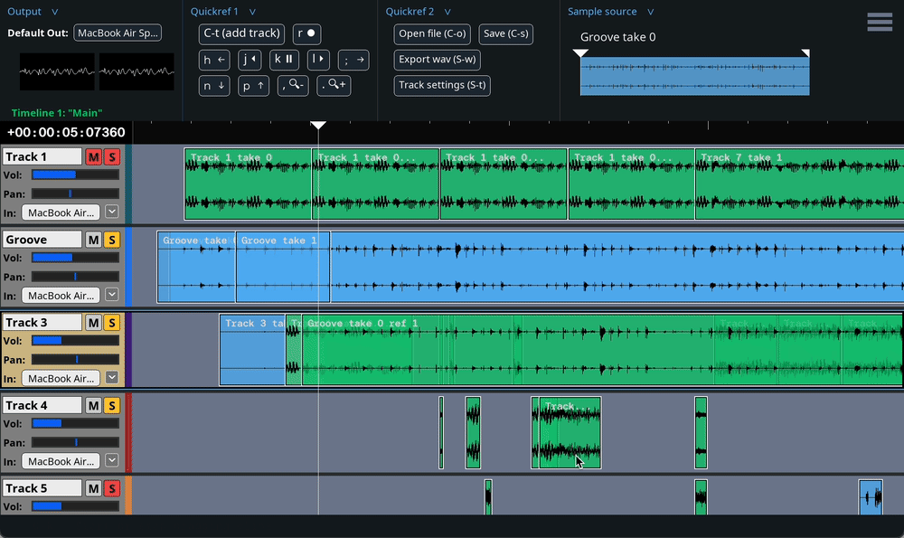

### Cutting clips

<kbd>S-c</kbd> : **Cut clips at cursor**<br>

This will cut any clips on the currently selected track at the current playhead position in two, so that you can independently move or otherwise modify each part.

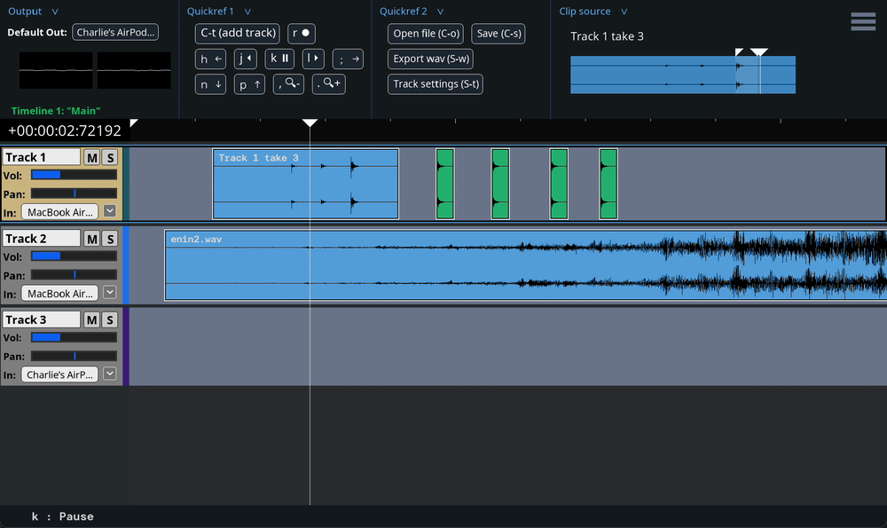

### Renaming clips

<kbd>C-S-r</kbd> : **Rename clip at cursor**<br>

See <a href = "#editing-text">"Editing text"</a> for more on text edit mode.

## Click tracks

You can add click tracks to your project to create a "grid."

<kbd>C-S-t</kbd> : **Add click track**<br>

Click tracks fundamentally comprise a series of one or more *segments*, each of which can have its own tempo and time signature. A lot of music will only require a single click track and single time signature, but jackdaw allows you to create many click tracks, each of which can have many segments.

<kbd>S-t</kbd> : **Edit click track**<br>

Edit the click track and segment at cursor with <kbd>S-t</kbd>, or by clicking the pencil icon on the left of the track.

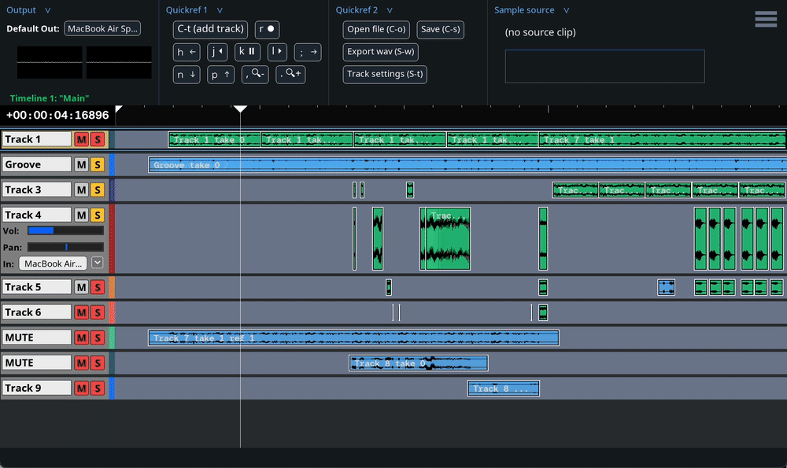

Then, <kbd>\<tab\></kbd> through the fields to modify any of the track parameters and "Submit" to confirm your changes to the time signature and tempo. (Changes to the track name do not need to be submitted.

### Time signatures

Jackdaw doesn't use conventional time signatures because they're confusing and limited. Instead, you specify first the number of "beats" (coarse divisions of a measure) and then the number of subdivisions in each of those beats. So a 4/4 time signature, which has 4 beats, could be defined as 4 + 4 + 4 + 4 if you want sixteenth-note resolution, or 2 + 2 + 2 + 2 if you only want eighth-note resolution. 6/8 typically has *two* beats, and would be defined as 3 + 3.

It is therefore very easy to define additive meters, like the Bulgarian Gankino horo (4 + 3 + 4):

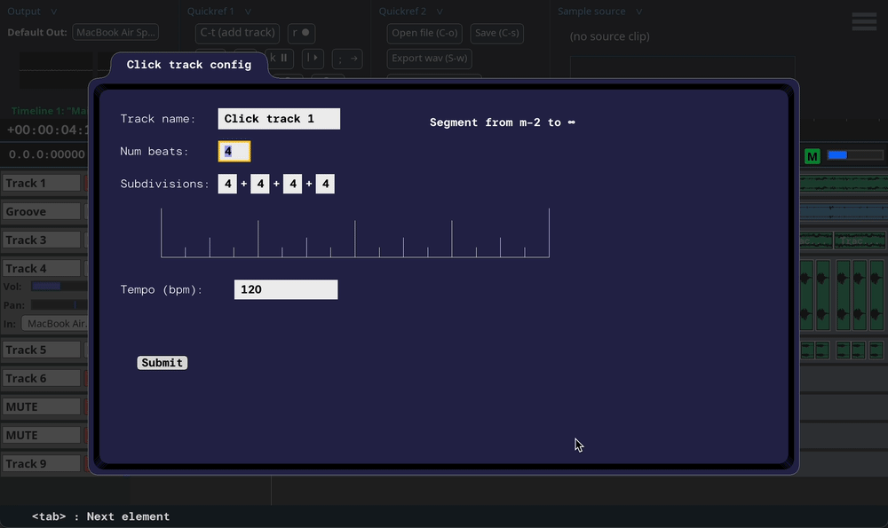


### Click track segments

If you need to change tempo or time signature partway through a song, you can do so by adding new click track segments.

To do so, **cut** the click track with <kbd>S-c</kbd>. (Note that this is the same function you would use to cut a clip, but if a click track is selected, it will cut the click track instead.

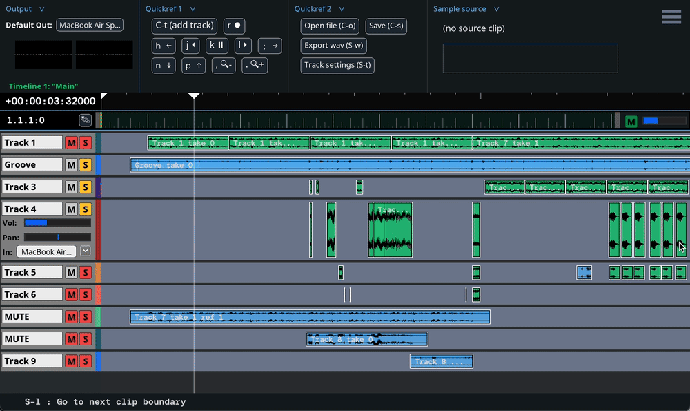

Now, you can modify each of the segments individually. When editing a segment, you can specify whether you want the end position to remain fixed, or the number of measures. If the number of measures is fixed, the end position of the segment may move, and all the segments to the right will move with it.

You can click and drag the boundaries between click track segments to reposition them, and you can delete a segment with <kbd>\<del\></kbd>

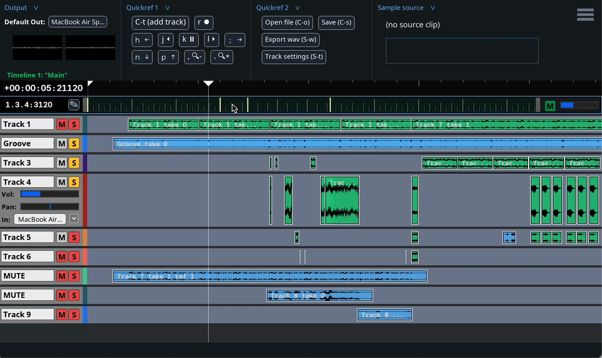

While dragging, the segment boundary will automatically snap to the previous segment's subdivisions. Hold <kbd>\<shift\></kbd> to disable the snapping.

### Metronome

Each click track has a metronome which is on by default. You can mute the click track exactly as you would an audio track (select the track and then <kbd>m</kbd>, and adjust the volume of the metronome exactly as you would adjust the volume of an audio track (<kbd>S--</kbd> and <kbd>S-=</kbd>).

### Set tempo

You can quickly set the tempo of the click segment at cursor with <kbd>t</kbd>


### Grid navigation

Click tracks can be moved up and down on the timeline exactly like audio tracks: with <kbd>S-n</kbd> and <kbd>S-p</kbd>.

All of the audio tracks directly *below* a given click track are governed by that click track. In the current version of jackdaw (v0.5.0) this is only relevant when using the following navigation functions:

<kbd>C-j</kbd> : **Go to previous beat**<br>
<kbd>C-l</kbd> : **Go to next beat**<br>

<kbd>C-S-j</kbd> : **Go to previous subdivision**<br>
<kbd>C-S-k</kbd> : **Go to next subdivision**<br>

<kbd>A-S-j</kbd> : **Go to previous measure**<br>
<kbd>A-S-k</kbd> : **Go to next measure**<br>

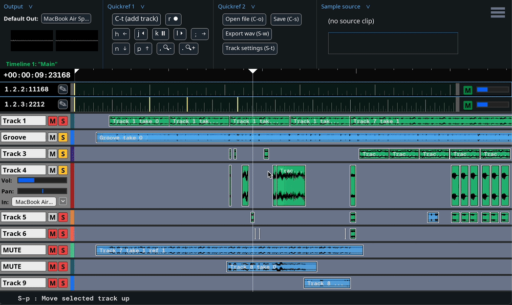


## Sample mode / Source mode

Jackdaw provides an interface for extracting samples from an audio clip, and dropping [references](#technical-note-clips-vs-clip-references) to those samples in your timeline.

<kbd>C-1</kbd> : **Load clip at cursor to source**<br>

If there is a clip at cursor, this function will load that clip to the source area near the top of the window.

<kbd>S-1</kbd> : **Activate or deactivate source mode**<br>

In source, you can play back, scrub through, and set marks in the clip that has been loaded into the source area. The marks you set here will determine which portion of the clip is dropped into your timeline when you:

<kbd>b</kbd> : **Drop clip from source**<br>

This creates a new clip reference on your timeline, at the current playhead position, on the currently-selected track.

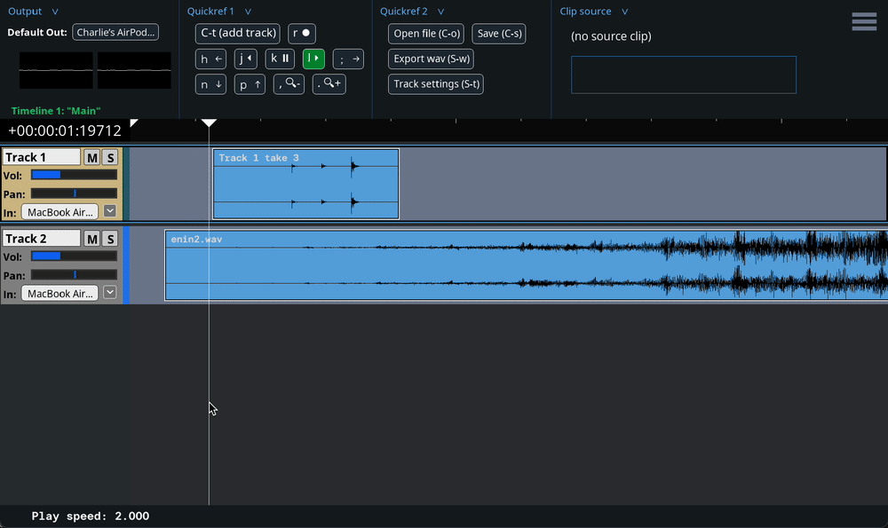

Every time you drop a clip into a timeline from the source area, jackdaw will save information about that drop. If you then drop something else into your timeline (either a different clip or the same clip with different marks) with <kbd>b</kbd>, you will be able to once again drop the previously-dropped clip with <kbd>v</kbd>. Another new drop will move the clip stored at <kbd>v</kbd> to <kbd>c</kbd>, so that you have unique clips that you can drop into your timeline with any of those three keys. Etc. for subsequent drops and <kbd>x</kbd> and <kbd>z</kbd>.

<kbd>b</kbd> : **Drop clip from source**<br>
<kbd>v</kbd> : **Drop previous clip (-1) from source**<br>
<kbd>c</kbd> : **Drop previous clip (-2) from source**<br>
<kbd>x</kbd> : **Drop previous clip (-3) from source**<br>
<kbd>z</kbd> : **Drop previous clip (-4) from source**<br>

## Project navigation / multiple timelines

Jackdaw provides a way to use multiple workspaces in a single project. Each of these is a "timeline," which is just a collection of tracks with associated clips. 

<kbd>A-t</kbd> : **Create new timeline**<br>
<kbd>A-l</kbd> : **Go to next timeline**<br>
<kbd>A-j</kbd> : **Go to previous timeline**<br>
<kbd>A-<del></kbd> : **Delete current timeline**<br>

When creating a new timeline, you will be prompted to enter a name. Type the name, hit <kbd>\<tab\></kbd> or <kbd>\<ret\></kbd> to move to the "Create" button, and then <kbd>\<ret\></kbd> again to complete naming the timeline.

## Opening and Saving files

### Opening files

Jackdaw is capable of opening two types of files: `.wav` and `.jdaw` (project) files. This can be done at launch time on the command line:

```console
$ jackdaw PATH_TO_FILE
```

It can also be done during runtime.

<kbd>C-o</kbd> : **Open a file**<br>

If a `.wav` file is opened, it will be loaded as a clip to the currently-selected track, starting at the current playhead position. If a `.jdaw` file is opened, the current project will be closed and replaced with the project saved in the `.jdaw` file.


### Saving a project

A `.jdaw` file stores a jackdaw project, including all of its timelines, tracks, clips, effects, automations, etc.

<kbd>C-s</kbd> : **Save project as**<br>

You will be prompted first to edit the current project file name. The file extension **must** be `.jdaw` or `.JDAW`; the program will encourage you to fix this if you make a mistake. Hit <kbd>\<tab\></kbd> or <kbd>\<ret\></kbd> to finish editing the name. Now, the directory navigation pane will be active, and you can use <kbd>n</kbd>, <kbd>p</kbd>, and <kbd>\<ret\></kbd> to navigate through the filesystem to the directory where you would like to save the file. When satisfied, type <kbd>\<tab\></kbd> and then <kbd>\<ret\></kbd> (or just <kbd>C-\<ret\></kbd> to save.)

Like everything else about jackdaw, the `.jdaw` file format is open and is described in the `jdaw_filespec` directory. (The current version as of writing is described in `jdaw_filespec/00.13`). 


## Track effects

### Adding, removing, and reordering effects

Up to 16 effects can be added to a given track. 

<kbd>S-e</kbd> : **Add effect to track**<br>
<kbd>S-t</kbd> : **Open track effects**<br>

The effects are displayed in a "tab view." The order in which the effects are processed is determined by the order of the tabs.

#### Tab view navigation

You can navigate the tab view with the mouse or with the keyboard:

<kbd>\<tab\></kbd> : **Cycle through page elements**<br>
<kbd>S-\<tab\></kbd> : **Cycle through page elements in reverse**<br>
<kbd>h</kbd> : **Nudge slider left**<br>
<kbd>;</kbd> : **Nudge slider right**<br>
<kbd>\<ret\></kbd> : **Select / toggle / cycle current element**<br>

You can also navigate to other tabs:

<kbd>S-j</kbd> : **Tab left**<br>
<kbd>S-l</kbd> : **Tab right**<br>

And reorder the tabs:

<kbd>C-S-j</kbd> : **Move current tab left**<br>
<kbd>C-S-l</kbd> : **Move current tab right**<br>

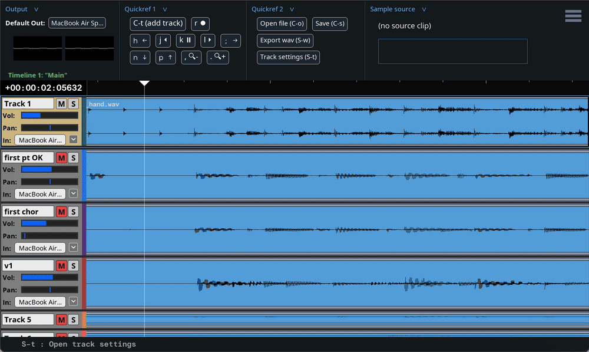

### EQ

The EQ effect contains 6 configurable filters. Each can be set to one of the following types:

1. Low-shelf / Highpass
2. Peak / Notch
3. High-shelf / Lowpass

The leftmost filter is low-shelf by default, the rightmost is high-shelf, and the others are peak/notch. Any given filter can be changed to any type by clicking the symbols representing the filter types.

The filter frequencies and amplitudes are modified by clicking and dragging the nodes on the spectral display:

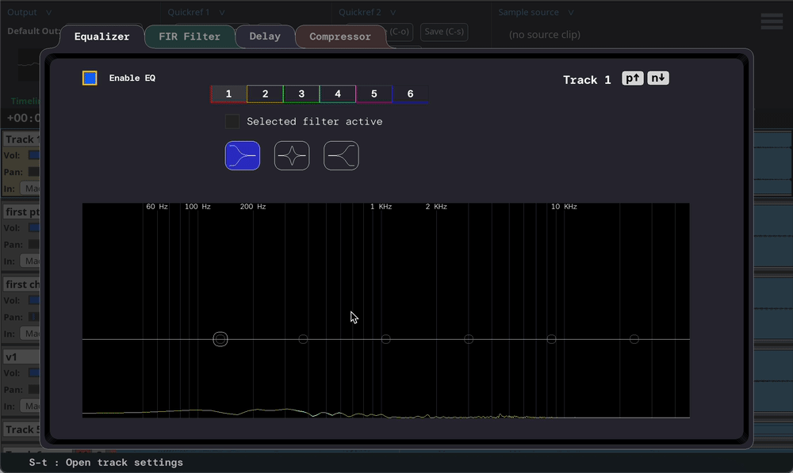

The bandwidth of a peak-notch filter can be adjusted by holding down `cmd` or `ctrl` and dragging the mouse up or down.

Each filter is a biquad infinite impulse response (IIR) filter. The low-shelf/high-shelf filters are based on the continuous-time Butterworth filter, and the peak/notch filters are implemented based on Joshua D. Reiss, ["Design of Audio Parametric Equalizer Filters
Directly in the Digital Domain", IEEE TRANSACTIONS ON AUDIO, SPEECH, AND LANGUAGE PROCESSING, VOL. 19, NO. 6, AUGUST 2011](https://www.eecs.qmul.ac.uk/~josh/documents/2011/Reiss-2011-TASLP-ParametricEqualisers.pdf).


### FIR filter

The FIR ("finite impulse response") filter is an FFT-based "[windowed-sinc](https://www.analog.com/media/en/technical-documentation/dsp-book/dsp_book_Ch16.pdf)" filter. It can be configured to have a low-pass, high-pass, band-pass, or band-cut frequency response. The cutoff frequency and bandwidth are adjustable parameters, as is the length of the impulse response. This last parameter affects the "steepness" of the frequency response curve. 

> [!NOTE]
> This is a computationally expensive effect. Applying FIR filters to many tracks may begin to cause audio playback issues if there is audio on those tracks that needs to be processed. (My 2020 macbook air maxes out at around 45.)

The frequency response of the filter is shown. When the filter is active, and playback is occurring, the frequency domain of the filtered audio track is also shown.

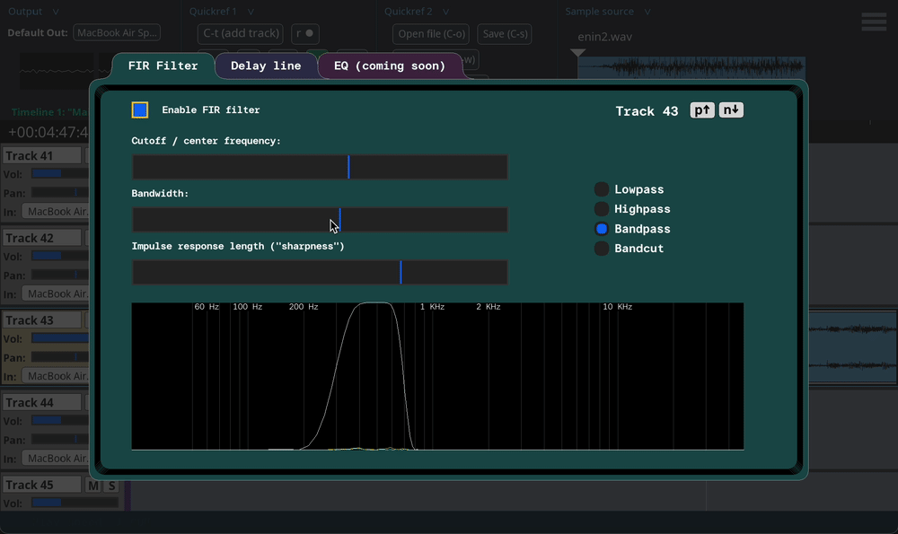


### Delay line

The delay line has three parameters: time, amplitude, and "stereo offset." The delay time is the amount of time between echoes, and the amplitude is the relative amplitude of each successive echo. "Stereo offset" delays playback of the delay line buffer in the left channel by some proportion of the delay line length, expressed as a value between 0.0 and 1.0. In other words, with a nonzero stereo offset, you will hear echoes at different times in the left and right channels.

### Saturation

The saturation effect does simple sample-wise wave shaping, rounding off the tops and bottoms of the signal peaks as they approach 1.0 and -1.0. There are two types available: the common `tanh` function, and and exponential function that behaves similarly. 

## Automation

Automation is available for the following track* parameters:
- Volume
- Pan
- FIR Filter cutoff frequency
- FIR Filter bandwidth
- Delay line length
- Delay line amplitude
- Play speed

*Play speed is a global parameter, not a track parameter. If play speed automation is added to multiple tracks, only the last of them will be read.

<kbd>C-a</kbd> : **Add automation to track**<br>
<kbd>a</kbd> : **Show / hide track automations**<br>

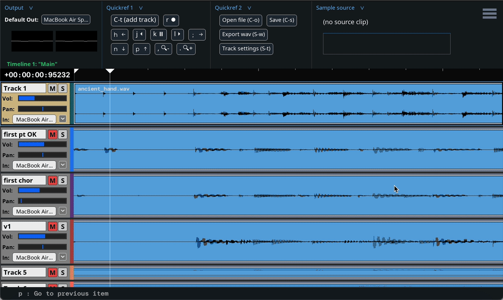

(Note that <kbd>n</kbd> and <kbd>p</kbd> (or <kbd>f</kbd> and <kbd>d</kbd>) can be used to cycle through the radio button options, and <kbd>\<tab\></kbd> and <kbd>S-\<tab\></kbd> can be used to move between the selector and the "add" button. The mouse is available but optional.)

### Adding keyframes with the mouse

Use <kbd>C-\<click\></kbd> to add a keyframe to an automation track. You can then drag the keyframe to the desired position. If you release cmd/ctrl and hold shift, the keyframe will will snap to the same vertical position as the previous keyframe, creating a flat segment. If you hold cmd or ctrl AND shift, the keyframe will snap to the position immediately after the previous keyframe, creating a near-vertical segment.

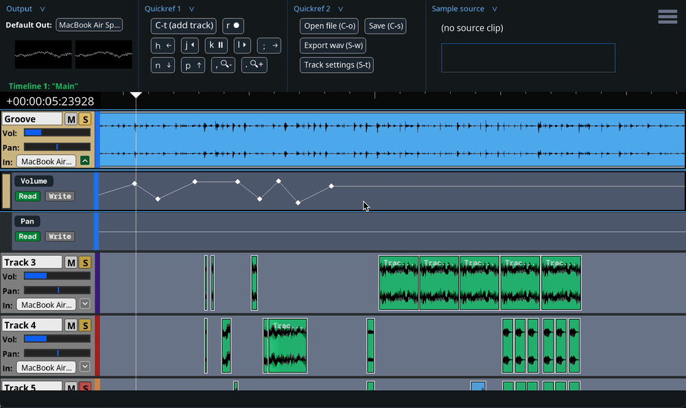

### Writing (adding keyframes automatically)

While an automation is in "write" mode, any changes to the automated parameter will be recorded on the automation track during playback. Any existing keyframes intersecting with the newly-written portion will be overwritten.

The easest way to accomplish this is to "record" on the automation track exactly as you would on an audio track: navigate the cursor to the automation track with <kbd>n</kbd> and <kbd>p</kbd> (or <kbd>f</kbd> and <kbd>d</kbd>) and hit <kbd>r</kbd> to start recording. Hit <kbd>r</kbd> again to stop.

<kbd>r</kbd> : **Start / stop recording automation** (when automation track selected)<br>

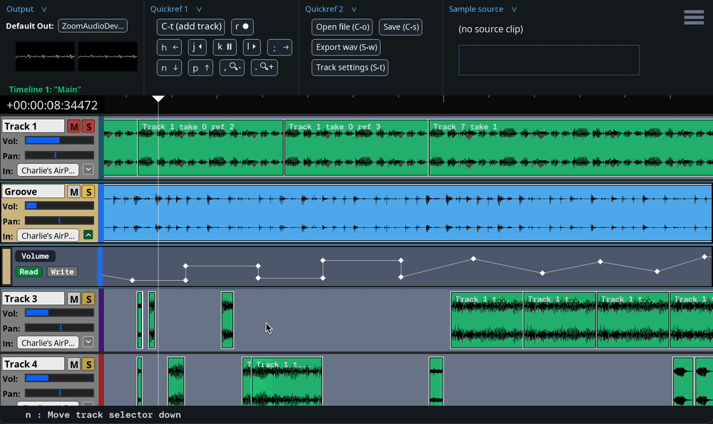

### Deleting keyframes

When an automation track is selected, you can delete a range of keyframes by marking (with <kbd>i</kbd> and <kbd>o</kbd>) a section of the timeline and hitting <kbd>del</kbd>.

<kbd>del</kbd> : **Delete keyframes in->out** (when automation track selected)<br>

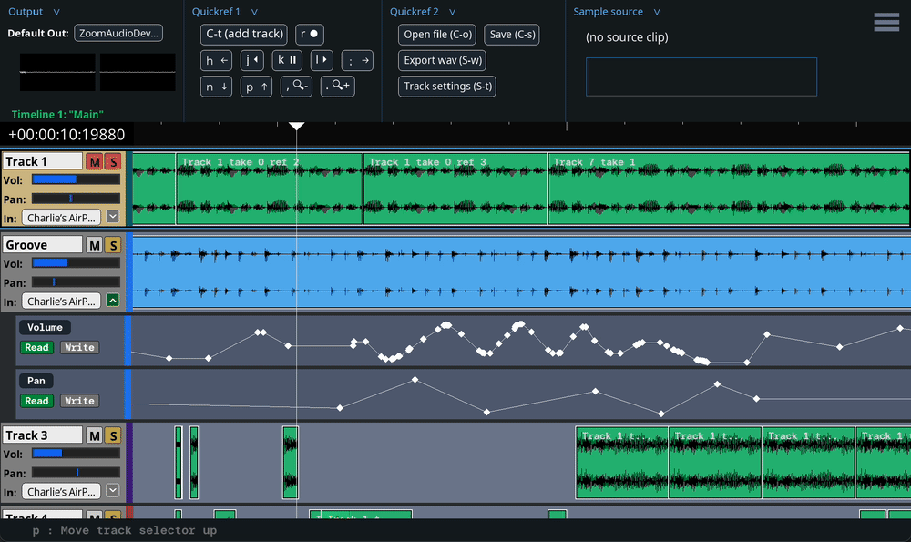

## Undo / redo

Jackdaw retains a 100-event long history of user events. Generally, any changes to the project state -- those that would affect the saved `.jdaw` file -- can be undone. Actions that only affect the superficial state of the program cannot.

Objects that you delete will not be permanently deleted until the program is closed or the deletion event drops off the end of the event history.

Jackdaw undo is *linear.* That means that if you undo some number of changes, and then make a new change, you will lose the ability to redo those previously-undone events.

<kbd>C-z</kbd> : **undo**<br>
<kbd>C-y</kbd> / <kbd>C-S-z</kbd> : **redo**<br>

## Special audio inputs

Jackdaw will have access to all of the audio devices (speakers, microphones, etc.) that your system knows about. In addition, there are two special audio inputs that you can use to record audio onto a track.

### Jackdaw out

Jackdaw is capable of using its own audio output as an audio input. This makes it very easy to create mixdowns on-the-go, or to record some of the fun sounds you can make by scrubbing through your timeline and [dynamically adjusting the playback speed](#dynamic-playback-speed-adjustment).

### Pure data

> [!NOTE]
> This is an experimental feature and is not yet reliable.

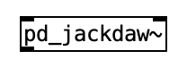

[Pure data](https://puredata.info/) (often "Pd") is a graphical audio programming environment developed by Miller Puckette. It is very similar to Max, which was also developed by Puckette, but unlike Max, is free to download and use. Pure data can be used to create things like synthesizers and drum machines, as well as sound production programs that are too unusual to be designated as such.

Pd also provides a method for writing your own objects (called "externals") for use in the program. Jackdaw is capable of communicating with (and receiving audio from) Pd by means of an external called `pd_jackdaw~`. This external needs to be built and loaded into Pd. 

I have provided the source code for `pd_jackdaw~` here (`pd_jackdaw/pd_jackdaw.c`), but have not yet provided the means to build it or load it into Pd. If you are so inclined, you may figure out how to do this using [pd-lib-builder](https://github.com/pure-data/pd-lib-builder).

The `pd_jackdaw~` objects inlets are for the left and right channels of audio. If jackdaw is open and a `pd_jackdaw~` object is created, the two programs will do a handshake (exchange a series of signals) before setting up a block of shared memory, which they use to exchange audio data. If DSP is enabled in Pd and a track input is set to "Pure data" in jackdaw, you should be able to record audio directly from Pd just as you would from a microphone.

## API

> [!NOTE]
> This is an experimental feature and will be developed further in future versions of jackdaw.

Jackdaw can run a UDP server to allow external programs (pure data, for instance, or your own programs) to modify project parameters like the volume on a given track, or a filter effect's cutoff frequency.

### Starting the server

<kbd>C-S-p</kbd> : **Start API server**<br>

You will be prompted to select a port number. If the port is in use or otherwise invalid, an error message will appear at the bottom-right part of the screen. If there is no error, you can assume that the server is currently running on the selected port.

### Request syntax

Requests must be ASCII strings that follow the general format:
```
<route> <value>
``` 

The `<route>` parameter describes a path to the desired parameter. Global parameters like the playback speed are identified at the top level, i.e. `/play_speed`. Parameters related to tracks must be routed through the timeline, then the track, each by name, and finally the name of the parameter. 

So if you want to access the volume parameter on a track called "Synth" on a timeline called "Main" (the default), the route would be:

```
/main/synth/vol
```

Note that uppercase characters in the names are lowered. Non-alphanumeric characters are replaced with an underscore. 

Here are some example requests:

`/main/track_1/pan 0.2`<br>&nbsp;&nbsp;&nbsp;&nbsp;&nbsp;&nbsp;--> set pan on track 1 to 0.2 (0.0 == L, 1.0 = R)

`/scratch_pad/kick/filter_cutoff_freq 0.2`<br>&nbsp;&nbsp;&nbsp;&nbsp;&nbsp;&nbsp;--> on the "scratch pad" timeline, set the "kick" track filter cutoff freq to 2% of nyquist (range 0.0 -> 1.0)


`/main/lead_synth/delay_line_len 600`<br>&nbsp;&nbsp;&nbsp;&nbsp;&nbsp;&nbsp;--> set the delay line effect time to 600ms


The currently-available endpoints are:

```
/play_speed
/<timeline>/<track>/vol
/<timeline>/<track>/pan
/<timeline>/<track>/filter_cutoff_freq
/<timeline>/<track>/filter_bandwidth
/<timeline>/<track>/delay_line_len
/<timeline>/<track>/delay_line_amp
/<timeline>/<track>/delay_line_stereo_offset
```

Most applications for the API will involve sending UDP messages over localhost, but messages can also be sent over a network. 

# Function reference

### global mode
- Summon menu : <kbd>C-m</kbd>, <kbd>C-h</kbd>
- Escape : <kbd>\<esc\></kbd>
- Quit : <kbd>C-q</kbd>
- Undo : <kbd>C-z</kbd>
- Redo : <kbd>C-y</kbd>, <kbd>C-S-z</kbd>
- Show output spectrum : <kbd></kbd>
- Save Project : <kbd>C-s</kbd>
- Open file (.wav or .jdaw) : <kbd>C-o</kbd>
- Start API server : <kbd>C-S-p</kbd>
- Function lookup : <kbd>\<spc\></kbd>
- Chaotic user test (debug only) : <kbd>A-S-\<del\></kbd>
### menu_nav mode
- Next item : <kbd>n</kbd>, <kbd>f</kbd>
- Previous item : <kbd>p</kbd>, <kbd>d</kbd>
- Next section : <kbd>C-n</kbd>, <kbd>C-f</kbd>, <kbd>C-\<up\></kbd>
- Previous section : <kbd>C-p</kbd>, <kbd>C-d</kbd>, <kbd>C-\<down\></kbd>
- Choose item : <kbd>\<ret\></kbd>, <kbd>k</kbd>
- Column right : <kbd>l</kbd>
- Column left : <kbd>j</kbd>
- Move menu up : <kbd>\<up\></kbd>
- Move menu down : <kbd>\<down\></kbd>
- Move menu right : <kbd>\<right\></kbd>
- Move menu left : <kbd>\<left\></kbd>
- go back (dismiss) : <kbd>\<del\></kbd>, <kbd>m</kbd>, <kbd>h</kbd>, <kbd>\<esc\></kbd>, <kbd>g</kbd>
### timeline mode
#### Playback / Record
- Play : <kbd>l</kbd>, <kbd>e</kbd>
- Pause : <kbd>k</kbd>, <kbd>w</kbd>, <kbd>S-k</kbd>
- Rewind : <kbd>j</kbd>, <kbd>q</kbd>
- Play slow : <kbd>K-l</kbd>
- Rewind slow : <kbd>K-j</kbd>
- Move playhead left : <kbd>[</kbd>
- Move playhead right : <kbd>]</kbd>
- Move playhead left (slow) : <kbd>S-[</kbd>
- Move playhead right (slow) : <kbd>S-]</kbd>
- Nudge play position left (500 samples) : <kbd>\<left\></kbd>
- Nudge play position right (500 samples) : <kbd>\<right\></kbd>
- Nudge play position left (100 samples) : <kbd>S-\<left\></kbd>
- Nudge play position right (100 samples) : <kbd>S-\<right\></kbd>
- Move one sample left : <kbd>C-S-\<left\></kbd>
- Move one sample right : <kbd>C-S-\<right\></kbd>
- Record (start or stop) : <kbd>r</kbd>
#### Timeline navigation
- Previous track (move selector up) : <kbd>p</kbd>, <kbd>d</kbd>
- Next track (move selector down) : <kbd>n</kbd>, <kbd>f</kbd>
- Toggle automation read : <kbd>S-r</kbd>
- Move selected track down : <kbd>S-n</kbd>, <kbd>S-f</kbd>
- Move selected track up : <kbd>S-p</kbd>, <kbd>S-d</kbd>
- Minimize selected track(s) : <kbd>-</kbd>
- Move view right : <kbd>;</kbd>
- Move view left : <kbd>h</kbd>
- Zoom out : <kbd>,</kbd>
- Zoom in : <kbd>.</kbd>
#### Marks
- Set In : <kbd>i</kbd>
- Set Out : <kbd>o</kbd>
- Go to In : <kbd>S-i</kbd>
- Go to Out : <kbd>S-o</kbd>
- Go to t=0 : <kbd>S-u</kbd>
- Go to previous clip boundary : <kbd>S-j</kbd>
- Go to next clip boundary : <kbd>S-l</kbd>
- Go to next beat : <kbd>C-l</kbd>
- Go to previous beat : <kbd>C-j</kbd>
- Go to next subdiv : <kbd>C-S-l</kbd>
- Go to previous subdiv : <kbd>C-S-j</kbd>
- Go to next measure : <kbd>A-S-l</kbd>
- Go to previous measure : <kbd>A-S-j</kbd>
- Bring rear clip at cursor to front : <kbd>S-z</kbd>
- Toggle loop playback : <kbd>C-8</kbd>
#### Output
- Set default audio output : <kbd>C-S-o</kbd>
#### Tracks
- Add Track : <kbd>C-t</kbd>
- Activate/deactivate selected track : <kbd>\<ret\></kbd>
- Activate/deactivate all tracks : <kbd>`</kbd>
- Delete selected track or automation : <kbd>C-\<del\></kbd>
- Activate track 1 : <kbd>1</kbd>
- Activate track 2 : <kbd>2</kbd>
- Activate track 3 : <kbd>3</kbd>
- Activate track 4 : <kbd>4</kbd>
- Activate track 5 : <kbd>5</kbd>
- Activate track 6 : <kbd>6</kbd>
- Activate track 7 : <kbd>7</kbd>
- Activate track 8 : <kbd>8</kbd>
- Activate track 9 : <kbd>9</kbd>
#### Tempo tracks
- Add click track : <kbd>C-S-t</kbd>
- Set tempo at cursor : <kbd>t</kbd>
#### Track settings
- Open track settings : <kbd>S-t</kbd>
- Mute or unmute selected track(s) : <kbd>m</kbd>
- Solo or unsolo selected track(s) : <kbd>s</kbd>
- Track volume up : <kbd>S-=</kbd>
- Track volume down : <kbd>S--</kbd>
- Track pan left : <kbd>S-9</kbd>
- Track pan right : <kbd>S-0</kbd>
- Rename selected track : <kbd>C-r</kbd>
- Set track input : <kbd>C-S-i</kbd>
- Show or hide all track automations : <kbd>a</kbd>
- Add automation to track : <kbd>C-a</kbd>
#### Clips
- Grab clip at cursor : <kbd>g</kbd>
- Grab clips in marked range : <kbd>S-g</kbd>
- Copy grabbed clips : <kbd>C-c</kbd>
- Paste grabbed clips : <kbd>C-v</kbd>
- Start or stop dragging clips : <kbd>C-k</kbd>
- Cut : <kbd>S-c</kbd>
- Split stereo clip at cursor to mono : <kbd></kbd>
- Rename clip at cursor : <kbd>C-S-r</kbd>
- Delete : <kbd>\<del\></kbd>
#### Sample mode
- Load clip at cursor to source : <kbd>C-1</kbd>
- Activate Source Mode : <kbd>S-1</kbd>
- Drop clip from source : <kbd>b</kbd>
- Drop previously dropped clip (1) : <kbd>v</kbd>
- Drop previously dropped clip (2) : <kbd>c</kbd>
- Drop previously dropped clip (3) : <kbd>x</kbd>
- Drop previously dropped clip (4) : <kbd>z</kbd>
#### Multiple timelines
- Add new timeline : <kbd>A-t</kbd>
- Previous timeline : <kbd>A-j</kbd>
- Next timeline : <kbd>A-l</kbd>
- Delete timeline : <kbd>A-\<del\></kbd>
#### Export
- Write mixdown to .wav file : <kbd>C-e</kbd>, <kbd>S-w</kbd>
### source mode
- Play (source) : <kbd>l</kbd>
- Pause (source) : <kbd>k</kbd>, <kbd>S-k</kbd>
- Rewind (source) : <kbd>j</kbd>
- Play slow (source) : <kbd>S-l</kbd>, <kbd>K-l</kbd>
- Rewind slow (source : <kbd>S-j</kbd>, <kbd>K-j</kbd>
- Set In Mark (source) : <kbd>i</kbd>, <kbd>S-i</kbd>
- Set Out Mark (source) : <kbd>o</kbd>, <kbd>S-o</kbd>
### modal mode
- Go to next item : <kbd>n</kbd>, <kbd>f</kbd>
- Go to previous item : <kbd>p</kbd>, <kbd>d</kbd>
- Go to next item (escape DirNav) : <kbd>\<tab\></kbd>, <kbd>S-n</kbd>, <kbd>S-f</kbd>
- Go to previous item (escape DirNav) : <kbd>S-\<tab\></kbd>, <kbd>S-p</kbd>, <kbd>S-d</kbd>
- Select item : <kbd>\<ret\></kbd>
- Dismiss modal window : <kbd>m</kbd>, <kbd>h</kbd>, <kbd>g</kbd>, <kbd>\<esc\></kbd>
- Submit form : <kbd>C-\<ret\></kbd>
### text_edit mode
- Escape text edit : <kbd>\<ret\></kbd>, <kbd>\<tab\></kbd>, <kbd>S-\<tab\></kbd>
- Escape text edit : <kbd>\<esc\></kbd>
- Backspace : <kbd>\<del\></kbd>
- Move cursor right : <kbd>\<right\></kbd>, <kbd>C-f</kbd>
- Move cursor left : <kbd>\<left\></kbd>, <kbd>C-d</kbd>, <kbd>C-b</kbd>
- Select all : <kbd>C-a</kbd>
### tabview mode
- Next element : <kbd>S-n</kbd>, <kbd>S-f</kbd>, <kbd>\<tab\></kbd>
- Previous element : <kbd>S-p</kbd>, <kbd>S-d</kbd>, <kbd>S-\<tab\></kbd>
- Select : <kbd>\<ret\></kbd>
- Move left : <kbd>h</kbd>
- Move right : <kbd>;</kbd>
- Next tab : <kbd>S-l</kbd>, <kbd>S-;</kbd>
- Previous tab : <kbd>S-j</kbd>, <kbd>S-h</kbd>
- Close tab view : <kbd>g</kbd>, <kbd>\<esc\></kbd>
### autocomplete_list mode
- Next item : <kbd>\<tab\></kbd>
- Previous item : <kbd>S-\<tab\></kbd>
- Select item : <kbd>\<ret\></kbd>
- Escape autocomplete list : <kbd>\<esc\></kbd>

...

[ LAST UPDATED 2025-03-02 SUNDAY ]

...
